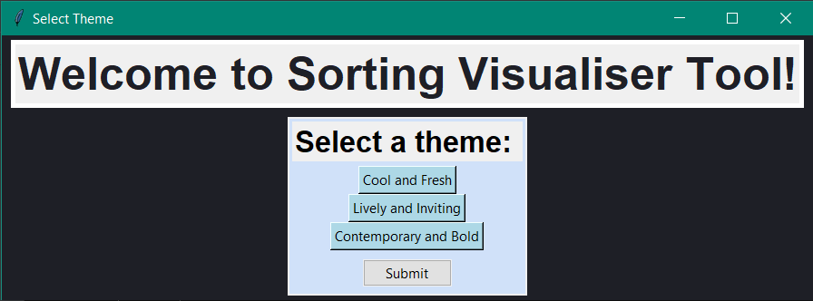
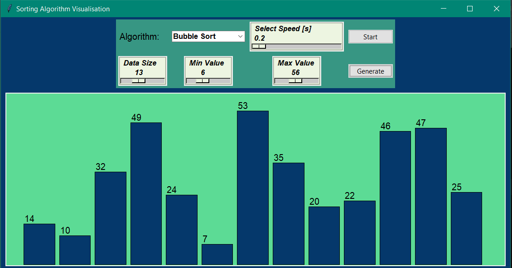
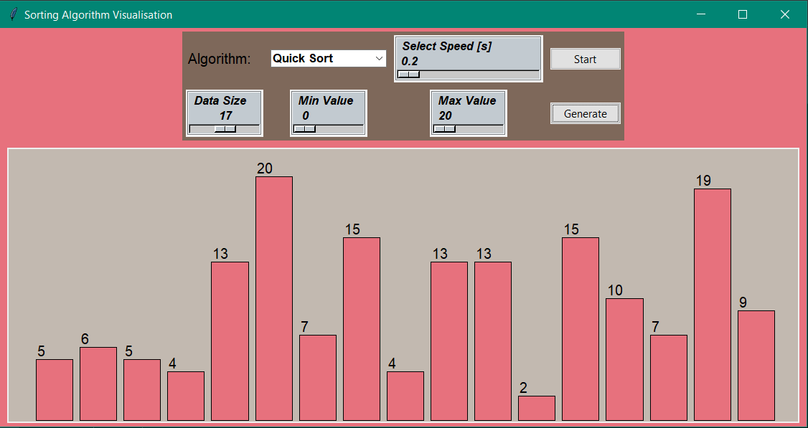
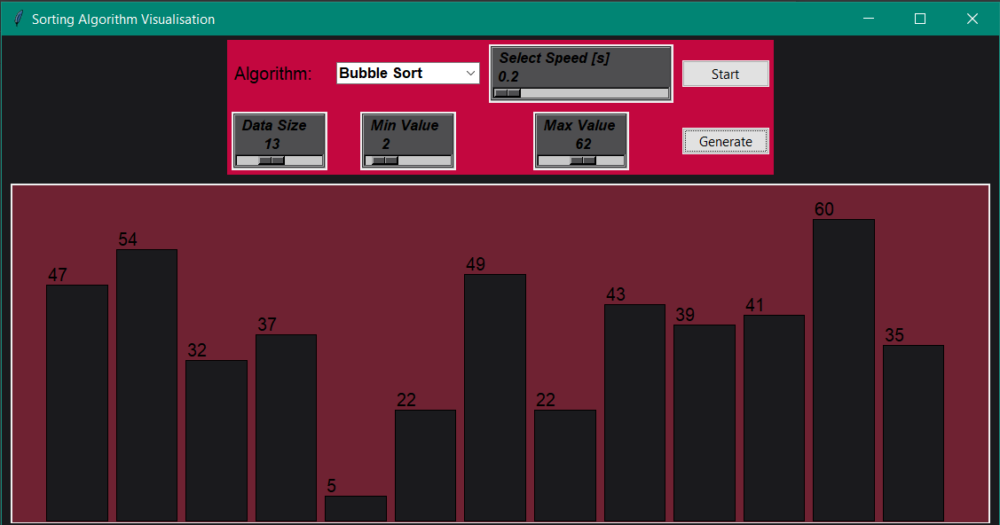

# Sorting-Visualiser-Tool

This is a Sorting visualiser tool made using [Tkinter](https://docs.python.org/3.7/library/tkinter.html). 

## Usage
1. Clone the repository. (click [here](https://docs.github.com/en/free-pro-team@latest/github/creating-cloning-and-archiving-repositories/cloning-a-repository) for help).
2. Open cmd or terminal.
3. Type `python sortingAlgos.py` or `python3 sortingAlgos.py` 
4. This tool has various themes. Select any theme and start using tool.

## Some output images

> Code is written in python 3.7 